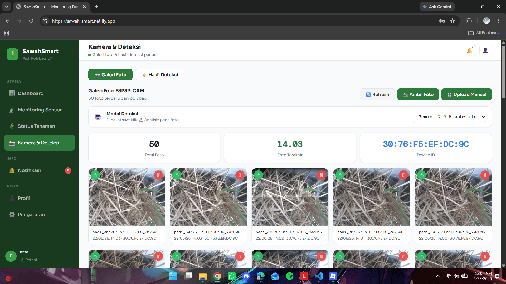
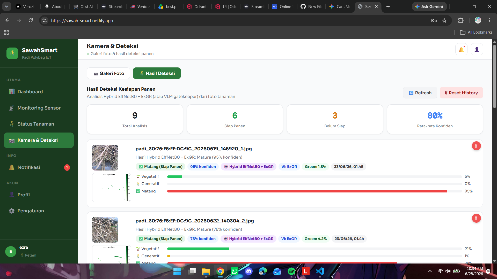

# SawahSmart — IoT + ML Rice Maturity Monitoring

End-to-end system that classifies rice growth stage (3 classes) from ESP32-CAM field images, served as a cloud inference API and a real-time PWA dashboard. Built as an S2 thesis: a comparative study of **VLM vs ML vs DL vs Hybrid** classifiers, deployed as a 2-tier architecture.




## Architecture (2-tier)

```
ESP32-CAM ──image──▶ Cloud Run (Flask API)
                          │
                  ┌───────┴────────┐
                  ▼                ▼
        Tier 1: VLM Gatekeeper   Google Cloud Storage
        (Gemini 2.5 Flash-Lite)  (image archive)
                  │
        is it rice? ──no──▶ reject ("BukanPadi")
                  │ yes
                  ▼
        Tier 2: Hybrid Classifier
        (CNN features + ExGR vegetation index)
                  │
                  ▼
        Vegetative / Generative / Mature
                  │
                  ▼
        Firebase RTDB ──▶ Web Dashboard (PWA)
```

- **Tier 1 — VLM gatekeeper**: open-world filter. Rejects non-rice images before classification. Gemini 2.5 Flash-Lite is the default (best VLM: test F1 0.956, mature recall 1.0).
- **Tier 2 — Hybrid classifier**: fuses CNN image features with handcrafted vegetation-index statistics. `Hybrid+ExGR` is the deployed default.

## Results

Comparative benchmark, 3-class (Vegetative / Generative / Mature). CV = 5-fold cross-validation macro-F1; Test = held-out set (n=104) with bootstrap mean; Mature = per-class F1 for the harvest-critical class.

| Track | Model | CV F1 | Test F1 | Mature F1 |
|-------|-------|:-----:|:-------:|:---------:|
| Hybrid | **Hybrid+NGRDI** | **0.977** | 0.962 | 0.955 |
| Hybrid | **Hybrid+ExGR** (deployed) | 0.969 | **0.966** | 0.955 |
| DL | EfficientNetB0 | 0.966 | 0.953 | 0.907 |
| ML | ExGR + SVM-RBF | 0.950 | 0.958 | 0.951 |
| VLM | Gemini 2.5 Flash-Lite | — | 0.956 | **1.000** |
| VLM | GPT-4o-mini | — | 0.917 | 0.978 |

Hybrid wins on both CV (NGRDI) and held-out test (ExGR). VLM gatekeeper hits perfect mature recall, which is why it fronts the pipeline for open-world safety.

## Dataset

519 raw images (HuggingFace 238 + Roboflow 281) → 1140 working images via Roboflow augmentation; 1036 for cross-validation, 104 held-out test.

## Tech Stack

- **Hardware**: ESP32-CAM (Arduino / PlatformIO)
- **ML/DL**: scikit-learn (SVM, 7 vegetation indices), TensorFlow/Keras (EfficientNet, Hybrid CNN+VI)
- **VLM**: Gemini 2.5 (Flash-Lite / Flash / Pro), GPT-4o / GPT-4o-mini
- **Backend**: Python Flask on Google Cloud Run
- **Storage**: Google Cloud Storage (images), Firebase Realtime Database (sensor + results)
- **Frontend**: HTML/CSS/JS Progressive Web App

## Project Structure

```
/firmware   ESP32-CAM Arduino/PlatformIO code
/backend    Python Flask API (Cloud Run)
/web        Progressive Web App dashboard
/ml         Models, benchmark, Streamlit app
/docs       System diagrams
```

## Deployment

```bash
gcloud run deploy upload-padi \
  --region asia-southeast2 \
  --allow-unauthenticated
```

Env: `GCS_BUCKET_NAME=padi-images-thesis-496412`
